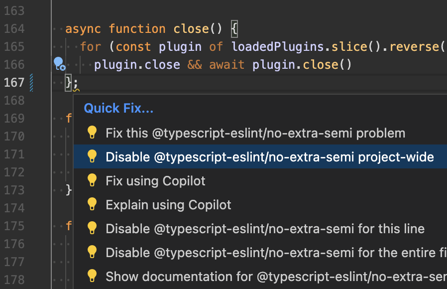

# ESLint Project Disabler 

ESLint Project Disabler is a VSCode extension which, when used with the official ESLint extension, will display the
ability to disable ESLint rules project-wide versus just line or file. JSON and YAML files are supported.

Install the extension [here](https://marketplace.visualstudio.com/items?itemName=larrygadea.eslint-project-disabler).

## Features

- ✏️ YAML and JSON files are supported (`.eslintrc.yaml`, `.eslintrc.yml` and `.eslintrc.json`)
- For YAML files it will put the new rule under the namespace of existing rules

## Screenshot

## Usage

1. Install the ESLint Project Disabler extension in Visual Studio Code.
2. Make a linting error in files matching any of these extensions: `**/*.{ts,tsx,jsm,mjs,cjs,jsx,html,vue}`
3. Click the lightbulb icon to open the quick fix menu.
4. Select the "Disable abc/def project-wide" option.
5. Watch in awe as you just saved a good 5 seconds of your life.
6. Consider giving this project a star :)

## Requirements

- Visual Studio Code
- ESLint extension configured for VSCode

## Contributing

If you'd like to contribute to the development of this extension, please feel free to submit a pull request or open an issue on the project's GitHub repository.

## License

This project is licensed under the MIT License. See the [LICENSE](LICENSE) file for details.
